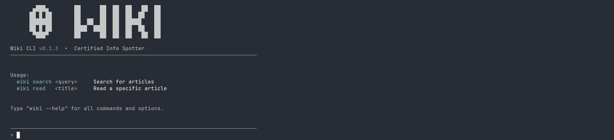
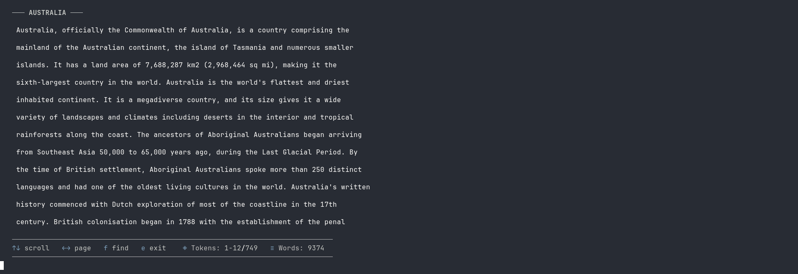
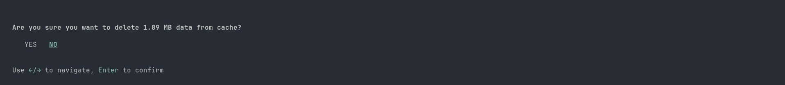
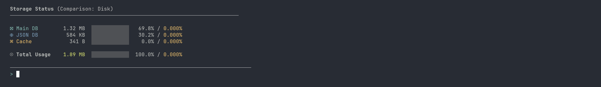
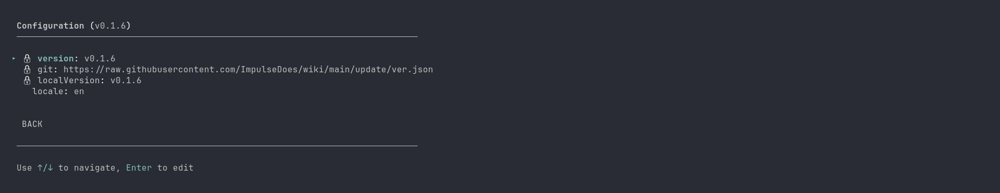

<div align="center">

```
  ▄███▄   ██      ██  ██  ██   ██  ██
 ██ █ ██  ██      ██  ██  ██  ██   ██
 ███████  ██  ██  ██  ██  █████    ██
 ██ █ ██  ████  ████  ██  ██  ██   ██
  ▀███▀   ██      ██  ██  ██   ██  ██
```

**Personal Wikipedia CLI**  
Distraction-free, fast, and open source.

[](https://www.npmjs.com/package/@impulsedev/wiki)
[](#license)
[](#)



</div>

---

## Installation

```bash
npm install -g @impulsedev/wiki
```

## Quick Start

```bash
wiki
```

Launches the interactive shell. No arguments needed.

---

## Features

- **Interactive REPL** - persistent shell, no re-launching between searches
- **Advanced Reader** - non-blocking, keyboard-driven article navigation
- **In-article Search** - find any phrase with live highlighting and match jumping

---

## Commands

Type directly into the shell. System commands are prefixed with `.`

### Search & Read

| Command | Description |
|---|---|
| `search <query>` | Find and index a new article from Wikipedia |
| `read <title>` | Open a cached article in the reader |
| `exit` · `e` | Close the application |

### System

| Command | Description |
|---|---|
| `.top` | Storage usage across all databases |
| `.cache` | Delete all cached articles and reset the database |
| `.config` | Show current application settings |
| `.clear` · `.c` | Clear the terminal and reset the interface |

---

## Reader Controls

Once inside an article:

| Key | Action |
|---|---|
| `↑` / `↓` | Scroll line by line |
| `←` / `→` · `PgUp` / `PgDn` | Scroll by page |
| `Home` / `End` | Jump to top / bottom |
| `f` | Enter search mode |
| `n` / `N` | Next / previous match |
| `q` · `e` | Exit reader |

---

## Screenshots

<details>
<summary>Article Reader</summary>



</details>

<details>
<summary>.cache command</summary>



</details>

<details>
<summary>.top command</summary>



</details>

<details>
<summary>.config command</summary>



</details>

---

## Storage

All data is kept in `./storage` - databases, tokenized articles, and cache index.  
Nothing is written outside that directory

---

## License

MIT - do whatever you want with it

---

<div align="center">
<sub>Screenshots taken on CachyOS, Ghostty, fish shell with tide theme</sub>
</div>